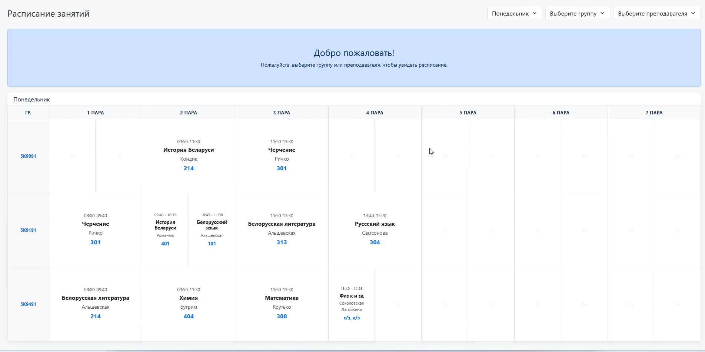

# Расписание МРК

Веб-приложение для управления и просмотра расписания занятий Минского радиотехнического колледжа (МРК), разработанное на Django.

## 🎬 Демонстрация

[](https://youtu.be/watch?v=4C-rjssuS9A)
## Основные возможности

- **Публичный просмотр**: Главная страница для студентов с удобной таблицей расписания.
- **Умная сетка занятий**: 
    - Автоматическое распределение по 7 парам (14 часам) согласно графику звонков.
    - Поддержка "половинок" пар (вертикальное разделение ячейки).
    - Поддержка многочасовых занятий (практик) с автоматическим объединением ячеек.
- **Фильтрация**: Быстрый поиск по группам, преподавателям и дням недели.
- **Админ-панель**: Защищенный раздел для управления всеми данными (занятия, преподаватели, предметы, группы).
- **Гибкое добавление**: Возможность создавать новые предметы и преподавателей прямо в форме добавления занятия.
- **Адаптивность**: Полная поддержка мобильных устройств (горизонтальный скролл с закрепленным столбцом групп).
- **Стилизация**: Дизайн выполнен в официальной цветовой гамме МРК.

## Технологии

- **Backend**: Django 5.2+
- **Database**: SQLite
- **Frontend**: Bootstrap 5, Django Templates
- **Auth**: Стандартная авторизация Django с кастомной страницей входа

## Инструкция по запуску

1. **Клонируйте репозиторий**:
   ```bash
   git clone <url_репозитория>
   cd mrk-schedule
   ```

2. **Создайте и активируйте виртуальное окружение**:
   ```bash
   python -m venv venv
   # Windows:
   venv\Scripts\activate
   # Linux/macOS:
   source venv/bin/activate
   ```

3. **Установите зависимости**:
   ```bash
   pip install django
   ```

4. **Примените миграции базы данных**:
   ```bash
   python manage.py makemigrations schedule_app
   python manage.py migrate
   ```

5. **Настройте учетную запись администратора**:
   - Откройте файл `superuser_credentials.txt` и введите желаемые `логин:пароль`.
   - Запустите скрипт инициализации:
     ```bash
     python init_admin.py
     ```

6. **Настройте порядок групп** (необязательно, если группы уже есть):
   ```bash
   # В PowerShell:
   Get-Content update_groups.py | python manage.py shell
   ```

7. **Запустите сервер**:
   ```bash
   python manage.py runserver
   ```

8. **Откройте приложение**: [http://127.0.0.1:8000/](http://127.0.0.1:8000/)

## Роуты

- `/` — Главная страница (только просмотр)
- `/login/` — Вход для администратора
- `/admin-panel/` — Управление расписанием (требует вход)
- `/schedule/add/` — Добавление занятия
- `/teachers/`, `/subjects/`, `/groups/` — Управление справочниками
- `/admin/` — Стандартная админка Django
